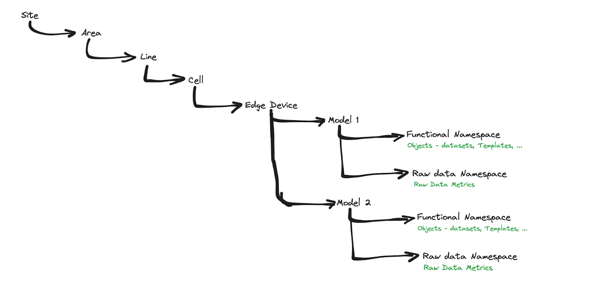

# Standards for Edge AI System Compatability with MQTT
Version 2023.11.15_Pre-Draft

## Introduction
MQTT is one of the most popular protocols for connecting IIoT devices and unifying distributed data sources. Using MQTT makes it easy to run centralized analytics in the cloud across a wide range of devices and sensors. However, with machine learning and AI reaching the edge, predictions and insights are being generated in real-time outside of the cloud. Currently, there are no well-defined standards for how predictions and insights generated by AI models from data sources such as camera feeds, acoustic sensors, and other unstructured data sources should be integrated into a MQTT-backed environments. This standard seeks to provide a reuseable yet flexible way to integrate edge AI into both Flat and Sparkplug B MQTT specifications.

## Questions answered by this standard
How should MQTT topics be defined in order to map onto AI terminology?
How should one name SparkPlug B-compliant topics for machine learning models operating at the edge?
How should topics be defined if a single device is running multiple AI models?
How should predictive insights be formatted to adhere to the SparkPlug B message format?

## Common Patterns for Edge AI on MQTT
Edge AI applications are wildly diverse and often need to incorporate high performance hardware, specialized sensors, and sophisticated ML models to process data sources such as video, audio, or raw machine data. However, for the sake of considering how edge AI and MQTT can work together, we can breakdown all of these applications into one of four patterns as shown in the table below.

Table A: Edge AI on MQTT Design Patterns
|                                                          | Subscribe to MQTT topic        | Ingest other data (other protocols, direct sensor data, etc.) |
|----------------------------------------------------------|--------------------------------|---------------------------------------------------------------|
| Publish predictions to MQTT topic                         | The "Fully-integrated" pattern | The "Unstructured Data" pattern                               |
| Publish predictions elsewhere (systems without MQTT support) | The "Ambassador" pattern       | Not covered by this standard                               |

### The "Fully-integrated" pattern
This pattern

### The "Unstructured Data" pattern
This pattern represents some of the most ideal applications for using AI at the edge. Unstructured data sources such as images, full motion video, audio, and lidar are not well suited to being transmitted over MQTT. First of all, they are increadibly large, heavy data sources. Secondly, many of them are continuous, meaning they do not align well with an event-based architecture.

### The "Ambassador" pattern

## Standards for Topic Definition

### Namespace  Definition
A key step to topic namespace structuring would be the identification of Edge AI namespaces. Here, I propose two namespaces to begin with: Raw Data Namespace and Functional Namespace. The namespaces can be renamed according to AI nomenclature.

#### Raw Data Namespace
The primary objective of the Raw Data Namespace is to hold, in the Unified Namespace, raw data as it appears from cameras and other sensors.

#### Functional Namespace
The primary objectives of the Functional Namespace are:
* Designing and structuring ML result data types.
* Implementing consistent naming conventions.
* Normalizing units of measurement.
* Mapping data to appropriate user-defined types (UDTs).
* Ensuring data compatibility and readiness for integration with other applications.
* And so on

### Flat MQTT Topic Namespace Structuring

#### Raw Data Namespace in Flat MQTT
How granular we want to go with the org hierarchy can be discussed.


#### Function Namespace in Flat MQTT


### MQTT Sparkplug Topic Namespace Structuring
The group_id  can be composed of all or hierarchy levels with delimiters, or the Sparkplug network can be restricted to L2, e.g. using the Production Line name.


Example: `site:area:line:cell/edge_nodeID/device/ID/raw_namespace/prediction/awefjio/1.0.0`


### UNS Snapshot
This is how it would look like in a Unified Namespace


Site 
	Area
		Line
			Cell
				Node
					Device
						“raw/temperature” -> JSON
						“predictions/model_id/version” -> JSON
						SafetyViolation -> bool


## Standards for Payload Definition
One simple option for adding ML outputs to an Sparkplug payload would be to use the string data type and just add model predictions and outputs in the form of raw json. This brute force option can certainly work in a pinch, but loses all of the benefits of Sparkplug’s structure, making it harder to scale different types of models across large MQTT deployments without a great deal of institutional knowledge needed to interpret results. A better approach would be to adopt the structure defined
Note: Templates may be the right solution for custom ML result data types such as classifications, segmentations, etc.
Explainability and drift (calculated locally by the model) could extend the top-level payload definitions?

### Payload data format tradeoffs: XML vs. JSON vs. Protobuf
When publishing data to an MQTT broker, there are a number of ways of encoding the information. The three most commonn types include XML, JSON, and Protobuf.

#### Protobuf
Protobuf is the highest performing format and should be the top choice in payload format when developing new AI & ML powered systems. Because data in the protobuf format is sent as bytes, not raw text, message sizes are much smaller when using protobuf as compared to XML or JSON. Additionally, `.proto` files enforce a common understanding of message formats, so schema changes resulting in downstream errors are not an issue. Protobuf is also used by Sparkplug, so it provides the most future-proof format.

#### JSON
JSON can also be a good choice for formatting payload data. First of all, JSON objects are human readable, which makes them easier to debug when developing new connected systems, compared to protbuf where the messages themselves are sent as bytes. Secondly, since JSON is ubiquitous, most systems can read, write, or interpret JSON. This makes it well suited for compatibility across multiple systems. Its primary downsides include the fact that message sizes are larger than protobuf, and there is no real mechanism to enforce a strict data structure. This results in scenarios where if an upstream system publishes a change to a JSON schema, downstream systems may experience errors until they have been updated to parse this change.

#### XML
XML has some value for legacy systems and may be a necessary choice, but it should be the last option in most situations. JSON provides similar levels of human readabillity to XML while protobuf offers a significantly smaller message size. Aside from legacy compatibility, it should generally be avoided.

#### Recommendation
It is recommended to default to a protobuf format for AI & ML model output messages when at all possible. In the event that protobuf does not support a certain integration, JSON is the next best option. This standard provides examples in both protobuf and JSON, but not XML.

### Flat MQTT model payloads
General payload object
```json
{
   "identifier":"inference-2HYZh8a4jtFi3xFc4e3TWRmclff",
   "model":{
      "identifier":"ed542963de",
      "version":"1.0.1",
      "name":"Sentiment Analysis"
   },
   "tags":{
      "srcTopic":"site.bld.asdf/asdf/asdf/asdf",
      "messageID":"abcd1234",
      "inputSizeInBytes":"32",
      "inputSha256Digest":"be01ef104fb88fd151132733e746fe29b997348bf34be875e25ba48c0d7436ca"
   },
   "explaination":{},
   "submittedAt":"2022-11-15T03:47:15.208Z",
   "completedAt":"2022-11-15T03:47:15.247Z",
   "elapsedTime":"0.039s",
   "results":[
      {
         "key":"results.json",
         "base64EncodedValue": "eyJkYXRhIjp7InJlc3VsdCI6eyJjbGFzc1ByZWRpY3Rpb25zIjpbeyJjbGFzcyI6ImpveSIsInNjb3JlIjowLjc2Mjg3MzgyODQxMTEwMjN9LHsiY2xhc3MiOiJhbmdlciIsInNjb3JlIjowLjIxMzUzODYzMTc5NjgzNjg1fSx7ImNsYXNzIjoiZmVhciIsInNjb3JlIjowLjAxNTAxMTU1NDU4MzkwNzEyN30seyJjbGFzcyI6InNhZG5lc3MiLCJzY29yZSI6MC4wMDQ5NDY1OTU5ODkxNjc2OX0seyJjbGFzcyI6InN1cnByaXNlIiwic2NvcmUiOjAuMDAyMTY4MDE2OTczODgyOTEzNn0seyJjbGFzcyI6ImxvdmUiLCJzY29yZSI6MC4wMDE0NjEzMDQ4NDA2MzE3ODN9XX0sImV4cGxhbmF0aW9uIjpudWxsLCJkcmlmdCI6bnVsbH19",
         "contentType":"application/json"
      }
   ]
}

```


#### Tensor


#### Classification
```json
{
   "classPredictions":[
      {
         "class":"className",
         "score":1.0
      }
   ]
}
```

#### Multi-classification
```json
{
   "classifications":[
      {
         "classPredictions":[
            {
               "class":"className",
               "score":1.0
            }
         ]
      }
   ]
}
```

#### Object detection
```json
{
   "detections":[
      {
         "class":"className",
         "score":1.0,
         "boundingBox":{
            "x":100,
            "y":200,
            "width":300,
            "height":400
         }
      }
   ]
}
```

#### Image segmentation

##### Run-length encoding format
```json
{
   "segments":[
      {
         "class":"className",
         "score":1.0,
         "imageMask":{
            "originalWidth":500,
            "originalHeight":600,
            "rle":[
               [1,0,1,0],
               [0,0,1,1]
            ]
         },
         "boundingBox":{
            "x":100,
            "y":200,
            "width":300,
            "height":400
         }
      }
   ]
}
```
##### Image format

##### Points format

#### Named entity recognition
```json
{
   "entities":[
      {
         "entityGroup":"B-LOC",
         "score":1.0,
         "textSpan":{
            "start":0,
            "end":5,
            "text":"Paris is a city."
         }
      }
   ]
}
```

#### Text summarization
```json
{
    "text":"Summarized text"
}
```

#### Text generation
```json
{
    "text":"Generated text"
}
```

#### Translation
```json
{
    "text":"Translated text"
}
```

#### Image
#### Video
#### Audio segmentation
#### Time-series classification
#### Regression
#### Ranking


### Sparkplug MQTT model payloads
Maching learning applications at the edge are primarily focused on providing two types of outputs (1) predictions about things the _may_ happen in the future and (2) insights translated from unstructured sources (audio, video, etc.) into structured insights (classification or detection). Downstream systems require detailed information in order to make use of these outputs...
#### Tensor
#### Classification
#### Recommended format for classification model outputs
#### Multi-classification
#### Object detection
#### Image segmentation
#### Named entity recognition
#### Text summarization
#### Text generation
#### Translation
#### Image
#### Video
#### Audio segmentation
#### Time-series classification
#### Regression
#### Ranking

## Contributors
Kudzai Manditereza, HiveMQ
Seth Clark, Modzy
Nathan Mellis, Modzy
Bradly Munday, Modzy
Brent Wassell, Oshkosh
Joshua Coenen, Oshkosh

## Appendix A: ML Message Definitions
### Results

```proto
syntax = "proto3";
package chassis.v2;

import "chassis/v2/types.proto";
import "google/api/field_behavior.proto";

message ClassificationResult {
message Prediction {
string class = 1 [(google.api.field_behavior) = REQUIRED];
double score = 2 [(google.api.field_behavior) = REQUIRED];
}
repeated Prediction class_predictions = 1;
}
message MultiClassificationResult {
repeated ClassificationResult classifications = 1;
}

message ObjectDetectionResult {
message Detection {
string class = 1 [(google.api.field_behavior) = REQUIRED];
double score = 2 [(google.api.field_behavior) = REQUIRED];
BoundingBox bounding_box = 3 [(google.api.field_behavior) = REQUIRED];
}
repeated Detection detections = 1;
}

// Segmentation
message SegmentationResult {
message Segment {
string class = 1 [(google.api.field_behavior) = REQUIRED];
double score = 2 [(google.api.field_behavior) = REQUIRED];
ImageMask image_mask = 3;
BoundingBox bounding_box = 4;
}
repeated Segment segments = 1;
}

message NamedEntityResult {
message NamedEntity {
string entity_group = 1 [(google.api.field_behavior) = REQUIRED];
double score = 2 [(google.api.field_behavior) = REQUIRED];
TextSpan text_span = 3;
}
repeated NamedEntity entities = 1;
}

// Text summarization
// Text generation
// Translation
message TextResult {
string text = 1;
}

// Image/video
message ImageResult {
repeated bytes data = 1;
}

// Audio segmentation
// Time-series classification
// Regression
// Ranking
```

## Explanations

```proto
syntax = "proto3";
package chassis.v2;

import "chassis/v2/types.proto";

message ImageExplanation {
ImageMask mask = 1;
}

message TextExplanation {
message TextSpanScore {
TextSpan text_span = 1;
double score = 2;
}
message ClassResults {
string class = 1;
repeated TextSpanScore scores = 2;
}
repeated ClassResults class_results = 1;
}

// Saliency maps
// SHAP
// Lime's tabular
// Lime text classification
// Object detection
```

## Appendix B: Example Implementations
