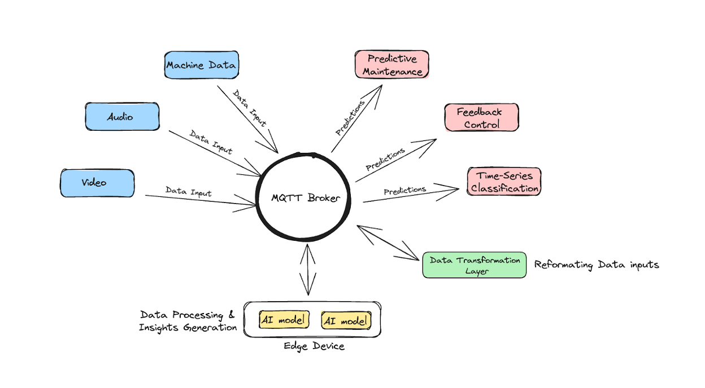
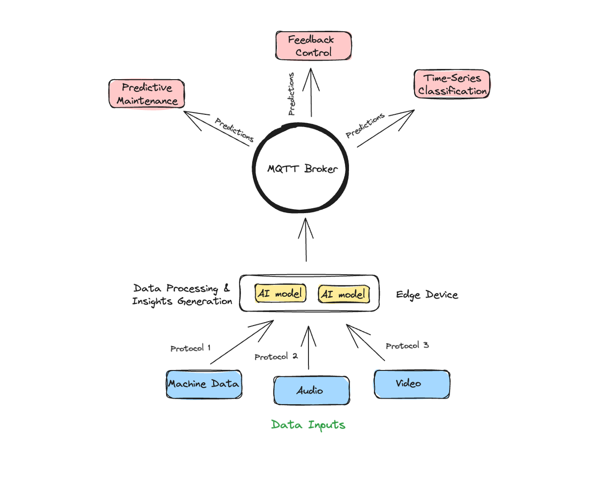
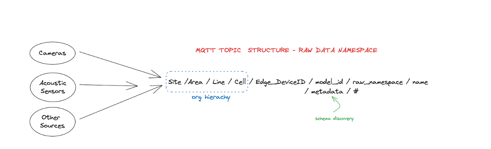
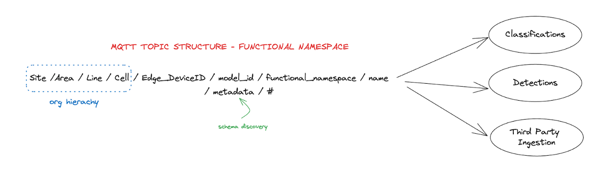
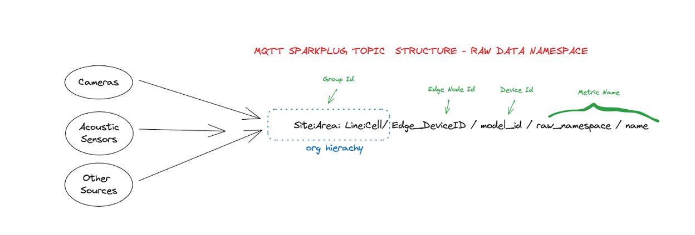
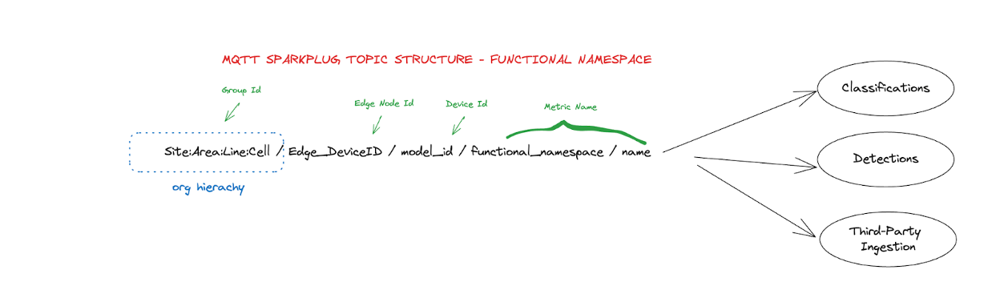

# Edge AI System Compatibility with MQTT
**Design Standards**

Version 1.0.0-alpha.1, 2023-12-08

## Version History
| Revision Number | Date | Author                       | Description   |
| --------------- | ---- | ---------------------------- | ------------- |
| 1.0.0-alpha.1   | TBD  | Edge AI on MQTT Project Team | Alpha Release |

Edge AI on MQTT Project Team members:
* Kudzai Manditereza, HiveMQ
* Seth Clark, Modzy
* Bradley Munday, Modzy
* Nathan Mellis, Modzy
* Joshua Coenen, Oshkosh Corporation
* Brent Wassell, Oshkosh Corporation

## Introduction
As more industrial companies integrate MQTT into their factory operations as a key part of their digital transformation strategy, the amount of data ready for integration with advanced analytics has grown rapidly. Consequently, organizations have turned to cloud computing to process this wealth of data and derive actionable insights.

Still, most AI-driven decisions and actions happen locally on-site. This trend has increased the need to shift AI data processing closer to production systems on the factory-floor — this is known as Edge AI. It allows for immediate feedback in automated manufacturing, reduces delays in data transfer, cuts down on data handling costs, and enhances data security. MQTT, which is an open, simple messaging system built for small devices and networks with high latency or low bandwidth, is becoming increasingly important in maximizing the advantages of Industrial Edge AI.

Yet, there's no clear standard for integrating AI-generated predictions and insights — from sources like video feeds or sound detectors — into MQTT-backed environments. This standard offers a reliable and adaptable method to integrate edge AI with MQTT frameworks, including the Flat MQTT and the Sparkplug B specification.

## Why Standardizing the Use of MQTT with Edge AI is Critical 
In the Edge AI ecosystem, AI models ingest data from data sources such as camera feeds, acoustic sensors, and other unstructured data sources to produce predictions. These models often use custom MQTT topics and payload structures for their inputs and outputs when connected to MQTT infrastructure. The absence of standardization in integrating AI model data into MQTT results in complex and non-scalable Edge AI deployments, which lack flexibility and reusability.

The standardization of MQTT in Edge AI is essential for several key reasons, which can be condensed into four main points:

**Interoperability and Flexibility**: Standardizing AI model input and output data over MQTT ensures that different devices and systems can integrate their data seamlessly, and it becomes easier to replace or upgrade components, as any compliant device should work with the rest of the system.

**Cost Savings and Accelerated Deployment**: A well-defined standard minimizes the need for customization, reducing resource allocation for integration, lowering costs, and speeding up the implementation of Edge AI solutions.

**Scalability and Consistency**: Standardizing enhances scalability, simplifying deploying various Edge AI components and updating existing ones, as the integration points would be clearly defined. It also ensures consistent data quality for reliable analysis and decision-making processes.

**Innovation and Community Engagement**: A standardized framework encourages innovation, providing a foundation for future advancements while leveraging community and industry support for continuous improvement.

## Common Patterns for Edge AI on MQTT

Edge AI applications vary greatly but typically incorporate high-performance hardware, specialized sensors, and sophisticated Machine Learning (ML) models to process various data types like video, audio, or machine outputs.


To understand the possible integration points between the Edge AI data ecosystem and MQTT, it's helpful to categorize these applications into four common patterns, as detailed in the following table.

Table A: Edge AI on MQTT Design Patterns
|                                        | Model Output: MQTT Publish      | Model Output: Other non-MQTT system |
|----------------------------------------|---------------------------------|-------------------------------------|
| **Model Input: MQTT Subscribe**        | The "Fully-integrated" pattern  | The "Ambassador" pattern            |
| **Model Input: Other non-MQTT system** | The "Unstructured Data" pattern | _Not covered by this standard_      |

### The "Fully-integrated" Pattern

The Fully-Integrated pattern describes an AI/ML system where both the data inputs and the resulting predictions are transmitted via MQTT. This approach is ideal for AI and ML applications that operate on structured data—like tables or machine data—that is already distributed through MQTT. Typical use cases for this pattern include predictive maintenance, feedback control systems, or time-series classification tasks.



A critical element in this pattern is the data format of incoming data being processed by a model. Machine Learning models often need data in specific formats, such as tables, tensors, or arrays, and while they can perform some basic preprocessing, incorporating complex data transformation within the model is inefficient. Instead, it's more efficient to standardize the format of the MQTT payload being sent to the model on any topic. This standardization can occur at the device sending the data by aligning with the required format or, more effectively, by adding a data transformation layer that reformats the data before it's resent to a new MQTT topic.

### The "Unstructured Data" Pattern

The "Unstructured Data" pattern refers to an AI/ML system designed to work with data that is not initially obtained through MQTT. Instead, this data comes from different systems or protocols, undergoes an AI/ML model processing, and then the resulting predictions are published to MQTT.



This pattern is particularly well-suited for edge AI applications because it deals with unstructured data types like images, full-motion video, audio, and lidar. Due to their size and continuous nature, these data types are typically large and do not fit MQTT's lightweight, event-driven framework. AI/ML models can analyze this bulky, continuous data to extract valuable insights, such as identifying specific objects, vehicles, or individuals. These insights, which are much smaller in size, can then be efficiently disseminated over MQTT, conserving bandwidth.

### The "Ambassador" Pattern

The "Ambassador" pattern describes an AI/ML system that takes in data through MQTT, processes it with one or more AI/ML models, and then forwards the processed data to another system using a different protocol.


In this setup, systems such as robotics can be a prime example. They receive sensor data via MQTT, an AI model generates predictions based on this data, and then these predictions are sent directly to a control system through another communication protocol.

## Guidelines for MQTT Topic Structure Design
Creating an efficient MQTT system hinges on establishing a topic structure that is both robust and adaptable. Various methodologies exist, such as the ISA-95 standard or the Sparkplug B specification. The guidelines in this document aim to complement these existing standards or to enhance custom topic structures. The emphasis here is on developing logical naming conventions that seamlessly integrate machine learning functionalities into existing MQTT ecosystems.

### Namespace Definitions
A critical initial step in structuring topic namespaces involves identifying specific namespaces for Edge AI. We recommend starting with two primary namespaces: the **Raw Data Namespace** and the **Functional Namespace**, which can be adapted to suit AI-related terminologies.

### Raw Data Namespace
The primary objective of the Raw Data Namespace is to hold, in the Unified Namespace, raw data as it appears directly from sensors. Typically this would include sensors that are generated "structured" data such as tables, log lines, or tensors. This namespace would not _typically_ be used with cameras or audio sensors as MQTT is not an ideal way to share unstructured data. In addition to the typical uses for raw data within an IIoT environment, this `raw` namespace would be used as a pre-defined AI model input in both the **"Ambassador"** and **"Fully Connected"** patterns.

_**Example**_

The `raw` namespace for a milling machine might be used to publish raw sensor data related to the milling machine's operation.

Notional topic for raw sensor data published by a milling machine:

```
site/area/line/cell/milling_machine/raw
```

Messages to this topic might include the following metrics:
* Air temperature (K)
* Process temperature (K)
* Rotational speed (rpm)
* Torque (Nm)
* Tool wear (min)

### Functional Namespace
The Functional namespace is designed to provide organization and structure for AI & ML outputs and insights generated from those outputs. This provides a number of benefits, including normalizing units of measurement, mapping data to appropriate user-defined types (UDTs), and ensuring data compatibility and readiness for integration with other applications.

There are two functional namespace categories that can be utilized when building edge AI systems on top of MQTT:

**inference**: Used for publishing the raw inferences generated by AI/ML models

**insight**: Used for publishing business metrics derived from underlying AI/ML models

#### Inference Namespace
This namespace element refers to metrics directly generated by a machine learning model. These outputs are highly transactional and do not necessarily provide business value on their own. In the context of computer vision, messages published to an "inference" metric might count the number of people and hardhats detected within a video frame.

_**Example**_

The `inference` namespace for the same milling machine might be used to publish AI predictions related to that machine's likelihood of failing in the future.

Notional topic for a failure prediction model running on data from a milling machine:

```
site/area/line/cell/milling_machine/Machine Failure Prediction/0.0.1/inference
```

Messages to this topic might include the following metrics:
* Failure Likelihood (with confidence score measured from 0 to 1)
* Non-Failure Likelihood (with confidence score measured from 0 to 1)


#### Insight Namespace
This namespace element would refer to metrics with innate business value that are composed, calculated, or otherwise built on top of individual inference metrics. In some cases, an insight might be based on inference metrics published by a **single model** on a **single edge device**. In these cases, the `insight` namespace element would exist at the same level as the `inference` namespace element; immediately following the `model_name/model_version` elements. However, insights may also be calculated from a combination of raw data and inference results from a **fleet of different models and devices**. In these cases, the insight namespace element would need move up one or more levels to be in the logically correct location.

_**Example - Single-device, Single-model Insight**_

Using the milling machine example, the "insight" namespace element might be used to publish business rules that are generated or calculated based on `inference` results: 

Notional topic for single-device, single-model insight:

```
site/area/line/cell/milling_machine/Machine Failure Prediction/0.0.1/insight
```
 
Messages to this topic might include the following metric:
* Maintenance Required: Published anytime the `inference/failure` score is larger than the `inference/no_failure` score, indicating that the Machine Failure Prediction model has found the milling machine to be likely to fail sometime soon.

_**Example - Multi-device, Multi-model Insight**_

Perhaps you need to identify any persons in an industrial space not wearing protective equipment. One AI/ML model could be used to identify the number of people detected across 10 cameras while another model identifies the number of hardhats detected across all of those cameras. The resulting metric "missing hardhats" would be calculated by subtracting the total number of hardhats from the total number of people found across all 10 camera feeds. In this example a new logical edge node is created called "PPE Safety Net" to represent insights related to PPE Safety within this portion of an industrial space.

Notional topic for multi-device, multi-model insight:

```
site/area/line/cell/PPE Safety Net/insight
```

Messages to this topic might include the following metrics:
* Missing Hardhats
* Missing HiVis Vests

### Topic Structure for Flat MQTT
One of the major benefits of flat MQTT, is that there are no requirements for how topic structures can or should be defined. This makes MQTT highly flexible for numerous applications, allowing each organizatiom to find a pattern that meets their needs. So as not to restrict namespace design for organizations using flat MQTT, this specification simply recommends appending edge AI-related namespace elements to end of the existing namespace structure.

```
[Customized MQTT topic structure]/Edge_DeviceID + /model_name/model_version/inference
```

**[Customized MQTT topic structure]**: Any existing top-level topic structure for a flat MQTT namespace

**Edge_DeviceID**: A unique identifier of some kind, pointing to the location of the device upon which an AI/ML model is running.

**model_name**: The name of a specific AI/ML model. A human-readable model name (i.e. `Machine Failure Prediction`) is the preferred way to structure this value, however care should be taken to choose a value for the model name that is stable and not likely to change. This may mean that using an alphanumeric identifier is actually the best choice (i.e. `brzrip6cxk`) so that a change in model's nickname doesn't impact downstream applications.

**model_version**: The specific version number of the model that is in use. Semantic versioning is recommended for this namespace element.

**inference**: The namespace element that will contain any messages generated by this version of this model. Specifications of the model payload itself are defined later on in this specification.


#### Raw Data Namespace




#### Functional Namespace




### Topic Structure for Sparkplug

Within the Sparkplug 3.0.0 specification, all MQTT clients MUST use the following topic namespace structure:

```
namespace/group_id/message_type/edge_node_id/[device_id]
```

Some of these fields are well-defined for any general purpose industrial application, but for other fields it becomes difficult to determine how they might apply to an AI model running at the edge. The following recommendations can be used to adapt these required fields to an AI/ML context:

**namespace**: `spBv1.0` is the most up-to-date version of the Sparkplug specification and should be used

**group_id**: Sparkplug's recommendation is for the Group ID to be descriptive, but as small as possible, to logically group Sparkplug Edge Nodes. In order to maintain parity between flat MQTT and Sparkplug, this specification recommends using a concatenation of the ISA-95 format of `site:area:line:cell` for this field, but that is not required for a successful edge AI implementation into a Sparkplug system.

**message_type**: This element must be one of 9 message types found withing the Sparkplub specification. AI & ML applications at the edge will primarily be posting new inference results using the `DDATA` message type, but `NBIRTH`, `NDEATH`, `DBIRTH`, `DDEATH`, and `NDATA` may also be needed.

**edge_node_id**: Edge nodes are defined as any client that manages an MQTT session. Based on this definition it is then recommended to **use this element to indicate the identity of the computing hardware** that is actively running models or communicaates to the MQTT broker on behalf of those models. Examples could include:
  * `ip_camera_1` An IP camera with an embedded GPU that is actively running one or more models.
  * `edge_server_1` A dedicated, on-site hosting server that is actively running one or more models.
  * `machinery_1` A piece of machinery with enough on-board processing power to run an AI/ML model locally. This may be the case for embedded models running on a microcontroller.

**device_id**: While often used to to indicate a physical or logical device, such as a PLC, this field can also be used to represent a logical grouping of data points. Using this latter definition, **use this element to indicate the identity of the AI/ML model** that is generating inferences. A human-readable model name (i.e. `Machine Failure Prediction`) is the preferred way to structure this value, however care should be taken to choose a value for the model name that is stable and not likely to change. This may mean that using an alphanumeric identifier is actually the best choice (i.e. `brzrip6cxk`) so that a change in model's nickname doesn't impact downstream applications.


#### Raw Data Namespace




#### Functional Namespace




### UNS Snapshot
Within the context of a unified namespace, raw and functional topics would coexist as follows.

Site

└ Area

&nbsp; └ Line

&nbsp; &nbsp; └ Cell

&nbsp; &nbsp; &nbsp; └ Node (aka Edge AI Hardware)

&nbsp; &nbsp; &nbsp; &nbsp; └ “raw/sensor_name” -> This raw value from a sensor is in the "Raw Data" namespace and is consumed by a model

&nbsp; &nbsp; &nbsp; &nbsp; └ Device (aka AI model)

&nbsp; &nbsp; &nbsp; &nbsp; &nbsp; └ “model_version/inference/inference_metric” -> This funtional value is a predicted value from a specific model and version

&nbsp; &nbsp; &nbsp; &nbsp; &nbsp; └ "model_version/insight/business_metric" -> This functional value is the business metric that is composed of some combination of raw data and AI insights.


## Standards for Payload Definition
Machine learning applications at the edge are primarily focused on providing two kinds of results:
1. Predictions about things the _may_ happen in the future
2. Structured insights (classifications or detections) that are extracted from unstructured sources like audio and video

To effectively utilize these results, downstream systems need them to be in a detailed, organized format. Creating standardized formats for these outputs enhances compatibility and interaction between systems.


### Encoding Edge AI Payloads for MQTT

When publishing data to an MQTT broker, the data can be encoded in several formats, with XML, JSON, and Protobuf being the most common.


#### Protobuf
Protobuf is the most efficient format and is highly recommended for new AI & ML systems. It transmits data as compact byte sequences rather than text, leading to significantly smaller messages than XML or JSON. Protobuf's use of .proto files ensures a uniform message structure, reducing the risk of errors from schema changes. Additionally, its compatibility with Sparkplug positions it as a future-proof choice.


#### JSON
JSON is a viable alternative for payload formatting. Its human-readable nature facilitates easier troubleshooting during the development of connected systems. Its widespread use across various platforms ensures high compatibility, though it does have larger message sizes than Protobuf and lacks strict structure enforcement. Changes in JSON schema may lead to errors in systems that haven’t been updated to accommodate these changes.


#### XML
XML is generally only recommended for legacy systems where it is already in use. While it is comparable to JSON in readability, it is bulkier than Protobuf. Unless required for older systems, XML is usually not the preferred choice.


#### Formatting Recommendation
For AI & ML model output messages, Protobuf should be used whenever possible for its efficiency and future-proofing qualities. If Protobuf is incompatible with certain integrations, JSON is the alternative. This standard offers examples in both Protobuf and JSON, but not in XML.


### Model Payload - Flat MQTT
For Flat MQTT applications, we recommend a universal payload template that would be consistent across various model types. This ‘model results’ template can then be customized to incorporate the unique data structure specific to each model. When represented in JSON format, the layout for this data structure would be as follows.

```json
{
   "identifier":"inference-2HYZh8a4jtFi3xFc4e3TWRmclff",
   "model":{
      "identifier":"brzrip6cxk",
      "version":"0.0.1",
      "name":"Machine Failure Prediction"
   },
   "tags":{
      "sourceTopic":"site:area:line:cell/node/device/raw/sensor_name",
      "sourceMessageID":"abcd1234",
      "inputSizeInBytes":32,
      "inputSha256Digest":"be01ef104fb88fd151132733e746fe29b997348bf34be875e25ba48c0d7436ca"
   },
   "resultType":"classPredictions",
   "result":{
      "classPredictions":[
         {
            "className":"no_failure",
            "score":0.974
         },
         {
            "className":"failure",
            "score":0.026
         }
      ]
   },
   "explaination":{
      
   }
}

```

Here's a breakdown of the key components in this Flat MQTT AI model output payload format:

**identifier**: This represents the unique ID for an individual inference. This ID can be useful for auditing or for mapping model predictions to a given piece of input data

**model**: This object provides important metadata about the model used to generate this output
 * **identifier**: A unique identifier that can be used to reference an individual model
 * **version**: The unique version of this model that was used to generate an inference
 * **name**: The human-friendly name for this model

**tags**: Tags provide a way to incorporate metadata related to the input fed into the model that generated an inference, including the topic that it came from, as well as a hash of the incoming data itself. This section can be extensible and include other metadata that is important to include with the inference.
 * **sourceTopic**: The topic that a model subscribed to in order to generate a prediction (relevant for **"Fully-integrated"** and **"Ambassador**" patterns)
 * **sourceMessageID**: The id of the message payload that this inference was generated in response to (relevant for **"Fully-integrated"** and **"Ambassador"** patterns)
 * **inputSizeInBytes**: Size in bytes of the data processed by this model to generate for this inference
 * **inputSha256Digest**: SHA256 digest of the model input (for security purposes)

**result**: The object containing a model's outputs
 * classPredictions: This key:value pair will be specific to the `modelType` format that is used by this model. The key _must_ match the value found in the `modelType` field.

**resultType**: Unique name for a specific model inference format. It can be one of the formats included in this specification, or a custom format developed for a niche application. This value needs to match the key of the JSON string included in the `results` object.

**explanation**: This field provides space to incorporate explainable outputs directly from the model itself. Explainable outputs are typically used to provide insight into how a machine learning model came to it's prediction


### Model Payloads - Sparkplug MQTT
When working with the Sparkplug specification, a single payload with model inference results will not suffice. Sparkplug uses a more sophistocated method of publishing different message types depending on the circumstance. For instance, when a device first comes online, a `DBIRTH` message must be published to establish the entire list of metrics that this device will publish in the future. After successfully publishing a `DBIRTH` new inferences can be published using the `DDATA` message type. As a result, there are a list of different model payloads that must be considered when integrating edge AI models into a Sparkplub system.


#### NBIRTH
NBIRTH messages are responsible for informing the host applications of all of the information about the Edge Node. Since this specification is generally treating the Edge Node as the piece of harware that is running a model, it may be necessary to publish an NBIRTH message for newly deployed hardware dedicated to AI/ML. However, if a model is running on an server that is already connected to a MQTT broker and has already published an NBIRTH message, then this message may not need to be published when a new model is deployed.


#### NDATA
NDATA messages are used to update the values of any Edge Node metrics that were originally published in the NBIRTH message. Again, if working with newly deployed hardware dedicated to AI/ML a new Edge AI application may need to routinely publish NDATA messages to update downstream appications about the device's status. However, if a model is running on an server that is already connected to a MQTT broker, then the management of NDATA messages is beyond the scope of any new edge AI application.


#### DBIRTH
DBIRTH messages for edge AI applications will need to inform Host Applications about all AI and ML metrics that it will be published by this edge device in the future. If new models are added to an edge device, a new DBIRTH message would need to be published.

_**Example:**_

```
spBv1.0/Site:Area:Line:Cell/DBIRTH/Raspberry Pi 3B 1/Machine Failure Prediction
```
 * The ‘Group ID’ is: Site:Area:Line:Cell
 * The ‘Edge Node ID’ is: Raspberry Pi 3B 1
 * The ‘Device ID’ is: Machine Failure Prediction
 * This is a DBIRTH message based on the _DBIRTH_ Sparkplug Verb

Consider the following Sparkplug B payload in the DBIRTH message shown above. Note that the model version number precedes the `inference` namespace element in each metric name. This makes it possible for multiple versions of the same model to be running simultaneously.
```
{
   "timestamp":1486144502122,
   "metrics":[
      {
         "name":"0.0.1/inference/identifier",
         "timestamp":1486144502122,
         "dataType":"string",
         "value":"inference-2HYZh8a4jtFi3xFc4e3TWRmclff"
      },
      {
         "name":"0.0.1/inference/model/identifier",
         "timestamp":1486144502122,
         "dataType":"string",
         "value":"brzrip6cxk"
      },
      {
         "name":"0.0.1/inference/model/version",
         "timestamp":1486144502122,
         "dataType":"string",
         "value":"0.0.1"
      },
      {
         "name":"0.0.1/inference/model/name",
         "timestamp":1486144502122,
         "dataType":"string",
         "value":"Machine Failure Prediction"
      },
      {
         "name":"0.0.1/inference/tags/sourceTopic",
         "timestamp":1486144502122,
         "dataType":"string",
         "value":"site:area:line:cell/node/device/raw/sensor_name"
      },
      {
         "name":"0.0.1/inference/tags/sourceMessageID",
         "timestamp":1486144502122,
         "dataType":"string",
         "value":"abcd1234"
      },
      {
         "name":"0.0.1/inference/tags/inputSizeInBytes",
         "timestamp":1486144502122,
         "dataType":"integer",
         "value":32
      },
      {
         "name":"0.0.1/inference/tags/inputSha256Digest",
         "timestamp":1486144502122,
         "dataType":"string",
         "value":"be01ef104fb88fd151132733e746fe29b997348bf34be875e25ba48c0d7436ca"
      },
      {
         "name":"0.0.1/inference/resultType",
         "timestamp":1486144502122,
         "dataType":"string",
         "value":"classPredictions"
      },
      {
         "name":"0.0.1/inference/result",
         "timestamp":1486144502122,
         "dataType":"string",
         "value":'{"classPredictions":[{"className":"no_failure","score":0.974},{"className":"failure","score":0.026}]}'
      }
   ],
   "seq":1
}
```

This would result in a structure as follows on the Host Application.

| Metric                                         |               | Value                                                                            | Data Type |
| ---------------------------------------------- | ------------- | -------------------------------------------------------------------------------- | --------- |
| Site:Area:Line:Cell                            | /group_id     |                                                                                  |           |
| └Edge Node ID                                  | /edge_node_id |                                                                                  |           |
| &nbsp; └Edge Device ID                         | /device_id    |                                                                                  |           |
| &nbsp; &nbsp; └Inference                       |               |                                                                                  |           |
| &nbsp; &nbsp; &nbsp; └identifier               |               | inference-2HYZh8a4jtFi3xFc4e3TWRmclff                                            | String    |
| &nbsp; &nbsp; &nbsp; └model                    |               |                                                                                  |           |
| &nbsp; &nbsp; &nbsp; &nbsp; └identifier        |               | brzrip6cxk                                                                       | String    |
| &nbsp; &nbsp; &nbsp; &nbsp; └version           |               | 0.0.1                                                                            | String    |
| &nbsp; &nbsp; &nbsp; &nbsp; └name              |               | Machine Failure Prediction                                                       | String    |
| &nbsp; &nbsp; &nbsp; └tags                     |               |                                                                                  |           |
| &nbsp; &nbsp; &nbsp; &nbsp; └sourceTopic       |               | site:area:line:cell/node/device/raw/sensor_name                                  | String    |
| &nbsp; &nbsp; &nbsp; &nbsp; └dataType          |               | abcd1234                                                                         | String    |
| &nbsp; &nbsp; &nbsp; &nbsp; └inputSizeInBytes  |               | 32                                                                               | Integer   |
| &nbsp; &nbsp; &nbsp; &nbsp; └inputSha256Digest |               | be01ef104fb88fd1...                                                              | String    |
| &nbsp; &nbsp; &nbsp; └resultType               |               | classPredictions                                                                 |           |
| &nbsp; &nbsp; &nbsp; └result                   |               | {"classPredictions":[{"className":"no_failure","score":0.974},{"className":"failure","score":0.026}]} | String    |


#### DDATA

The DDATA message will be used for publishing new inference results whenever they are generated by a model. This could include every result generated by a model, or the Edge Node could apply "report by exception" logic to all model inferences and only publish results when a certain detection or classification is found. In either of these cases, the DDATA payload needs only to publish metrics that have _changed_. As a result, it can be more compact than the DBIRTH message, since metrics like "inference/model/name" will not change from one inference to another.

_**Example:**_
```
spBv1.0/Site:Area:Line:Cell/DDATA/Raspberry Pi 3B 1/Machine Failure Prediction
```
* The ‘Group ID’ is: Site:Area:Line:Cell
* The ‘Edge Node ID’ is: Raspberry Pi 3B 1
* The ‘Device ID’ is: Machine Failure Prediction
* This is a DDATA message based on the _NDATA_ Sparkplug Verb

Consider the following Sparkplug B payload in the DDATA message shown above:
```
{
   "timestamp":1486144502122,
   "metrics":[
      {
         "name":"0.0.1/inference/identifier",
         "timestamp":1486144502122,
         "dataType":"string",
         "value":"inference-2HYZh8a4jtFi3xFc4e3TWRmclff"
      },
      {
         "name":"0.0.1/inference/tags/sourceTopic",
         "timestamp":1486144502122,
         "dataType":"string",
         "value":"site:area:line:cell/node/device/raw/sensor_name"
      },
      {
         "name":"0.0.1/inference/tags/sourceMessageID",
         "timestamp":1486144502122,
         "dataType":"string",
         "value":"abcd1234"
      },
      {
         "name":"0.0.1/inference/tags/inputSizeInBytes",
         "timestamp":1486144502122,
         "dataType":"integer",
         "value":32
      },
      {
         "name":"0.0.1/inference/tags/inputSha256Digest",
         "timestamp":1486144502122,
         "dataType":"string",
         "value":"2o3nvi30fh4fb88fd120932733e746fe29b99732ifhi34be875e25ba48c0d7436ca"
      },
      {
         "name":"0.0.1/inference/result",
         "timestamp":1486144502122,
         "dataType":"string",
         "value":'{"classPredictions":[{"className":"no_failure","score":0.087},{"className":"failure","score":0.913}]}'
      }
   ],
   "seq":1
}
```


#### DDEATH
If a model ever stops running or loses connection, a DDEATH message must be sent by the Edge Node to inform downstream devices that the model is no longer live.

_**Example:**_
```
spBv1.0/Site:Area:Line:Cell/DDEATH/Raspberry Pi 3B 1/Machine Failure Prediction
```
* The ‘Group ID’ is: Site:Area:Line:Cell
* The ‘Edge Node ID’ is: Raspberry Pi 3B 1
* The ‘Device ID’ is: Machine Failure Prediction
* This is a DDEATH message based on the _DDEATH_ Sparkplug Verb

Consider the following Sparkplug B payload in the DDEATH message shown above:
```json
{
  "timestamp": 1486144502122,
  "seq": 123
}
```


### AI/ML Model Result Formats
Below are recommended JSON structures for the most common types of machine learning models. Protofile definitions of these data formats are also available in the appendix and on Github.


#### Classification
Classification is used to assign a class to an individual piece of data. This might be useful for classifying an individual image, audio snippet, video frame, or a piece of machine data.
```json
{
   "classPredictions":[
      {
         "class":"className",
         "score":1.0
      }
   ]
}
```


#### Time series classification
Time series classification is used to classify a temporal range within a larger time series data set. This might be useful for classifying audio, video, or sensor data.
```json
{
   "timeSeriesPredictions":[
      {
         "class":"className",
         "score":1.0,
         "start":"2020-01-06 00:00:00.000000",
         "end":"2020-01-06 00:00:59.000000"
      }
   ]
}
```


#### Multi-classification
Similar to classification models, but used when model outputs are grouped into more than two distinct classes.
```json
{
   "classifications":[
      {
         "classPredictions":[
            {
               "class":"className",
               "score":1.0
            }
         ]
      }
   ]
}
```


#### Object detection
Object detection is used to identify regions of interest within an image or video that are defined by a bounding box. Bounding boxes can have one or more classifications, and images can have one or more bounding boxes.
```json
{
   "detections":[
      {
         "class":"className",
         "score":1.0,
         "boundingBox":{
            "x":100,
            "y":200,
            "width":300,
            "height":400
         }
      }
   ]
}
```


#### Image segmentation
Image segmentation is used to highlight specific pixesl within an image or a video frame that are of importance. There are three primary ways to communicate which portions of an image are of importance: run-lenth encoding (RLE), point specification, and raw image outputs.


##### Run-length encoding format
```json
{
   "segments":[
      {
         "class":"className",
         "score":1.0,
         "imageMask":{
            "originalWidth":500,
            "originalHeight":600,
            "rle":[1,0,1,0,0,0,1,1]
         },
         "boundingBox":{
            "x":100,
            "y":200,
            "width":300,
            "height":400
         }
      }
   ]
}
```


##### Image format


##### Points format
```json
{
   "segments":[
      {
         "class":"className",
         "score":1.0,
         "imageMask":{
            "originalWidth":500,
            "originalHeight":600,
            "points":[
               {
                  "x":1,
                  "y":0
               },
               {
                  "x":1,
                  "y":1
               },
               {
                  "x":2,
                  "y":0
               },
               {
                  "x":2,
                  "y":1
               }
            ]
         },
         "boundingBox":{
            "x":100,
            "y":200,
            "width":300,
            "height":400
         }
      }
   ]
}
```


#### Named entity recognition
Named entity recognition is used to identify unique entities, such as names, organizations, and locations, within a larger corpus of text.
```json
{
   "entities":[
      {
         "entityGroup":"B-LOC",
         "score":1.0,
         "textSpan":{
            "start":0,
            "end":5,
            "text":"Paris is a city."
         }
      }
   ]
}
```


#### Text summarization
Text summarization is used to 
```json
{
    "text":"Summarized text"
}
```


#### Text generation
```json
{
    "text":"Generated text"
}
```


#### Translation
```json
{
    "text":"Translated text"
}
```


#### Audio segmentation
```json
{
    "segments": [
        {
            "class": "className",
            "score": 1.0,
            "timestamp": "00:00:12.414"
        }
    ]
}
```

#### Regression


#### Ranking


#### Base64 Encoded Image
```json
{
    "base64Image":"data:image/jpeg;base64,/9j/4AAQ...//2Q=="
}
```


## Appendix A: ML Message Definitions


### Results
```proto
syntax = "proto3";
package chassis.v2;

import "chassis/v2/types.proto";
import "google/api/field_behavior.proto";

message ClassificationResult {
message Prediction {
string class = 1 [(google.api.field_behavior) = REQUIRED];
double score = 2 [(google.api.field_behavior) = REQUIRED];
}
repeated Prediction class_predictions = 1;
}
message MultiClassificationResult {
repeated ClassificationResult classifications = 1;
}

message ObjectDetectionResult {
message Detection {
string class = 1 [(google.api.field_behavior) = REQUIRED];
double score = 2 [(google.api.field_behavior) = REQUIRED];
BoundingBox bounding_box = 3 [(google.api.field_behavior) = REQUIRED];
}
repeated Detection detections = 1;
}

// Segmentation
message SegmentationResult {
message Segment {
string class = 1 [(google.api.field_behavior) = REQUIRED];
double score = 2 [(google.api.field_behavior) = REQUIRED];
ImageMask image_mask = 3;
BoundingBox bounding_box = 4;
}
repeated Segment segments = 1;
}

message NamedEntityResult {
message NamedEntity {
string entity_group = 1 [(google.api.field_behavior) = REQUIRED];
double score = 2 [(google.api.field_behavior) = REQUIRED];
TextSpan text_span = 3;
}
repeated NamedEntity entities = 1;
}

// Text summarization
// Text generation
// Translation
message TextResult {
string text = 1;
}

// Image/video
message ImageResult {
repeated bytes data = 1;
}

// Audio segmentation
// Time-series classification
// Regression
// Ranking
```


## Explanations

```proto
syntax = "proto3";
package chassis.v2;

import "chassis/v2/types.proto";

message ImageExplanation {
ImageMask mask = 1;
}

message TextExplanation {
message TextSpanScore {
TextSpan text_span = 1;
double score = 2;
}
message ClassResults {
string class = 1;
repeated TextSpanScore scores = 2;
}
repeated ClassResults class_results = 1;
}

// Saliency maps
// SHAP
// Lime's tabular
// Lime text classification
// Object detection
```
